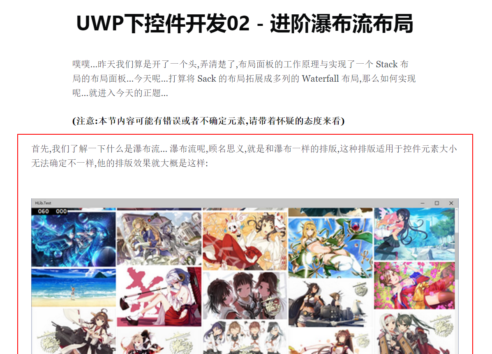
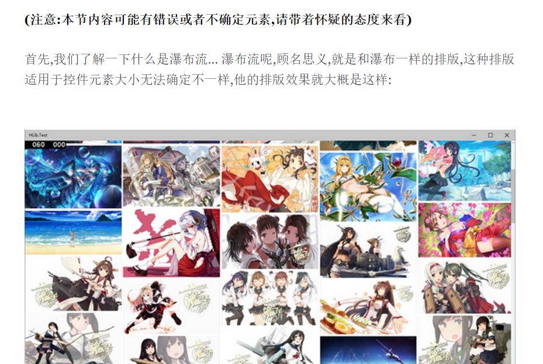

Ghost 默认的 CSS 会导致图片超过文章的总图宽度，而且会带动图片上面一段文字和图片等宽，就像下面的图片中红框部分一样。看起来十分的难看，我自己看也觉得十分的难受。所本篇文章就来告诉大家到底如何解决这个问题，让
Ghost 看起来更加美观。  
<!--truncate-->


# 原理说明

很简单的的做法，打开浏览器的调试工具，查看 CSS 就知道不知道什么原因导致 Ghost 有这么一条 CSS：

```CSS
.post-full-content img {
    margin: 1.5em 0;
    max-width: 1040px;
    width: 100vw;
}
```

其中的 max-width 就是罪魁祸首，我们需要用另外一条 CSS 来强行复写这条规则。
在 Ghost 后台的代码注入的 Blog Header 中加上这么一句：

```Markup
<style type="text/css">
.post-full-content img {
    max-width: none !important;
    width: 100% !important;
}
</style>
```

这条规则强行将 max-width 改为 none，并将 width 改为容器的 100%。保存之后刷新即可看到效果。
