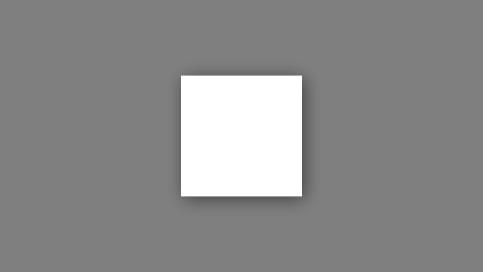
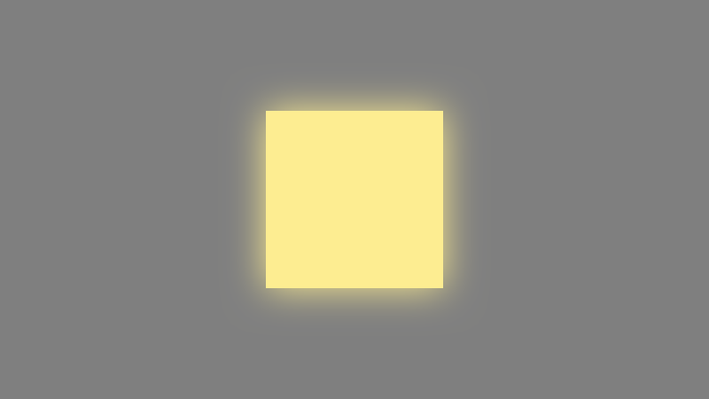
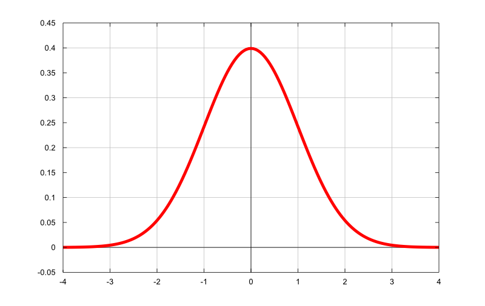
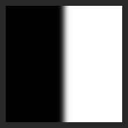
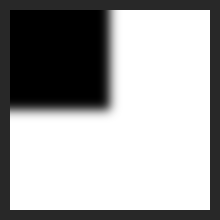
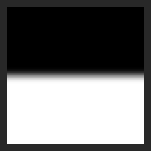
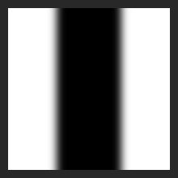
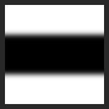
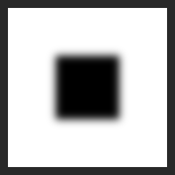

欢迎回来！

由于一些工作原因，最近一年对 OpenGL
有一些比较浅的研究。但是也并不是十分精通，只是停留在差不多能用的程度。所以中间也没有什么特别有意思的东西值得拿来写博客，不过前几天倒是遇到了挺有意思的东西，所以就有了这篇博客。

OpenGL 虽然不区分 2D 和 3D，但是也是由于工作原因，我对于 OpenGL 的了解也仅仅是停留在 2D 的层面，所以本篇博客也仅仅是对 2D
的矩形绘制阴影，也没有动态光源这么一说，仅仅只是大家平时 UI 上用得最多的阴影风格（参考 Material Design）。

<!--truncate-->

# 简单的阴影原理

上面提到了我完全不懂 3D 上的 OpenGL，所以在这里我们并不讨论 3D 意义上的阴影，甚至也不是 2D 意义上的阴影，只是大家在 UI
上用得最多的伪阴影。



如上图所示，在各种 UI 设计中，这样的控件阴影算是十分常见了，Material Design 中尤其多。一般来说这种阴影的原理十分简单，就是将原图内容的
Alpha 通道取出来，然后用阴影色填充，然后根据阴影的扩散程度，进行高斯模糊，然后要有一定色差效果的话，再做一定量的偏移即可。

同理这种风格也能用于做外发光，用过 PhotoShop 的同学肯定对于外发光不会陌生，像上面的阴影的原理也适用于外发光，无非是一个是暗色为主，一个是亮色为主，一个可能具有一定的视差效果，一个没有。



# 麻烦的高斯模糊

上一个小节里面提到了阴影的核心就是对一个同形状的图形进行高斯模糊，在这一个小节，我们会简单说明一下高斯模糊的原理和过程。

具体的数学概念就不展开讨论了，我八成也没有办法讲清楚。在高中我们都学过了正态分布（高斯分布），我们可以想象一下正态分布的概率密度函数，一个小山丘的形状。



我们假设我们有一个方便的函数 $f(x)$，其函数图形就如上图所示，在这个例子中是标准正态分布，其正态分布方差（$σ$）为 1。

完整而完美的高斯模糊是十分麻烦而且低效的，每一个像素都需要对整张图片进行采样才能计算出来。

1. 假设当前我们正在模糊目标像素 $(u,v)$，$u$，$v$ 分别是目标像素在图片上的横纵坐标。
2. 我们需要遍历图片的每一个像素，假设当前遍历到的像素是 $(x,y)$ 。
3. 将 $(u,v)$ 与 $(x,y)$ 的距离当作 $x$ 填入之前的方便函数 $f(x)$ 中，算出一个权重值 $γ$。
4. 然后将当前遍历的像素 $(x,y)$ 的颜色 $(r,g,b)$ 乘以之前算出来的 $γ$，得到 $γ*(r,g,b)$。
5. 最后将遍历所有像素的算出来的求和，得到 $\sum γ*(r,g,b)$。将所有 $γ$ 求和，得到 $\sum γ$。
6. 然后将 $\sum γ*(r,g,b)$ 除以 $\sum γ$ 就可以得到当前一个像素的高斯模糊结果了。

可以看得出来，高斯模糊中，如果每个像素绘制权重值 $γ$
的等高线话，等高线就是符合正态分布的，我们可以将上面的一维正态分布的概率密度函数，延伸到二维空间想象。对于像素 $(u,v)$
，就有一个均匀的小山丘，而 $(u,v)$ 就在小山丘的中间。

如果针对每个图都做完美的正态分布的话，其算法的时间复杂度为 $O(m²*n²)$，其中 m，n 分别是图片的宽高。可以看得出来这是一个性能非常差的算法。


但是我们再回过头来看一下正态分布的概率函数曲线 $f(x)$，可以看出来，差不多在 $x$ 为 $-3σ$ 与 $3σ$
的时候，函数曲线就已经十分平滑了，所以在实际运用过程中，我们大概只算周围半径为 $3σ$（模糊半径 $r$）圆内的像素就可以了，这样复杂度就降到了
$O(m*n*σ)$。

# 关键的**线性可分**

高斯模糊有一个十分有用的性质可以用于我们减少算法的时间复杂度，就是高斯模糊本身是线性可分的。表现在二维图片先横向高斯模糊，然后再纵向高斯模糊，和直接进行二维的高斯模糊的效果是一致的。

这样我们可以将高斯模糊拆封成横向和纵向两个步骤，这样时间复杂度就降到了 $O((m+n)*σ)$
，实际上大多数的高斯模糊实现也都是这么做的，现在你能在网上找到的高斯模糊实现都是以 2-pass 或者 4-pass 居多。

而高斯模糊线性可分的另一个意思就是多个小半径的高斯可以组合成一个大半径的高斯模糊，例如对一个图片先进行半径为 3
的高斯模糊，对其结果再进行半径为 4 的高斯模糊，其结果和直接对图片进行半径为 5 的高斯模糊效果一致。

# 简化的卷积过程

从前面我们已经知道了高斯卷积过程是十分繁琐的，主要的性能消耗也在这个地方，但是我们要算高斯模糊的对象却十分简单，仅仅只是一个矩形，甚至都只有黑白两色。所以从这个方面出发，我们是否能够针对这个特定的场景进行简化，从而降低时间复杂度。

依据上面的思路，我们可以把矩形拆分成两个部分，一个部分是边缘，而另一个部分是矩形的角。



## 简化处理矩形边

我们可以把矩形边理解成一个纯黑与纯白的交界，左边是纯黑的，右边是纯白的。


在上面的章节，我们提到了高斯模糊是线性可分的，我们就将一个边缘的模糊分为纵向模糊和横向模糊。而在进行纵向模糊的情况下，我们发现每一列的像素值都是一模一样的，所以高斯卷积这一过程就被简化成
f(x) = x，没有任何变化。这当然没有问题，当你对一张纯白的图进行模糊的时候，结果也只能是一张纯白的图。

所以二维的高斯模糊就被降维到一维了，我们只需要做一维（横向）的计算就能算出矩形的边缘模糊了。时间复杂度被进一步简化到 $O(m*σ)$。

另外有意思的事情是，我们仅仅只需要关心距离边缘在模糊半径以内的像素，因为在大于模糊半径的地方，所有的需要采样的像素都是一样的，所以这些部分也被简化到了
$f(x) = x$，那么我们的时间复杂度就被进一步简化到了 $O(σ)$，现在我们的算法已经和矩形的大小没什么关系了，只需要卷积一次，就能获得所有边缘的卷积结果。

那么，我们的算法还可能简化吗？答案是肯定的，我们的卷积过程十分固定，在边缘左边的坐标 $-r$ 到边缘右边的左边 $r$
的变化是恒定的，但是权重的变化速率却决于模糊半径，这里可以假定另一个函数 $f(x)$ ，$x$ 是横坐标，结果表示这次高斯卷积的结果。

$f(x)$ 不仅仅和 $x$ 有关系，也和 $r$ 有关系，而这个关系是线性的。所以接下来我们将模糊半径 $r$ 约掉，将 $f(x)$ 写成 $f(y / r)$ 的形式然后用
g(y) 表示。然后我们可以发现 $g(y)$ 就是当 $r$ 为 1 的情况下的 $f(x)$。

这样我们就把 $r$ 从 $f(x)$ 中提取出来了，$g(y)$ 是一个固定的函数，只和 $y$ 相关，我们可以用一个多段式的曲线拟合这个函数。

```c
// =============================================================================
// approximation to the gaussian integral [x, infty)
// =============================================================================
static finline float gi(float x)
{
    const float i6 = 1.f / 6.0;
    const float i4 = 1.f / 4.0;
    const float i3 = 1.f / 3.0;
    if (x > 1.5) return 0.0;
    if (x < -1.5) return 1.0;
    float x2 = x * x;
    float x3 = x2 * x;
    if (x >  0.5) return .5625  - ( x3 * i6 - 3 * x2 * i4 + 1.125 * x);
    if (x > -0.5) return 0.5    - (0.75 * x - x3 * i3);	// else
                  return 0.4375 + (-x3 * i6 - 3 * x2 * i4 - 1.125 * x);
}
```

$gi(x)$ 就是我们最后拟合的函数，只需要将 x 带入就能得到最后高斯卷积的近似值。当 x 为 -1.5 时，就是在左边的模糊半径的边缘 -r，为
0 时就是在矩形边缘处，而 1.5 的时候就是在右边的模糊半径边缘 r。

这下，我们也不需要做卷积积分了整个复杂度也变成了 $O(1)$，没有任何变量和我们的矩形边缘模糊相关了。

## 简化处理矩形角

有了 1 条边的模糊就有了 4 条边的模糊，有了 1 个角的模糊，那么 4 个角的模糊也会都出来了。

矩形角的模糊我们无法采用降维打击了，完整的矩形角的模糊需要进行完整的卷积，然后我们就算能将卷积拆分为两次，第一次卷积过程能够如法炮制使用拟合函数模拟卷积过程，但是第二次卷积是取决于第一次卷积的，我们很拟合。

看上去，我们必须要要对角做特殊处理了。不！我们可以牺牲一些精度，来简化矩形角的模糊过程。

假设我们将横向模糊函数叫做 $f(x)$，纵向模糊函数叫做 $g(x)$，整个模糊过程应该是 $f(g(x))$ 或者 $g(f(x))$
，就是由于这样的高阶函数导致了我们无法拟合卷积过程，但是我们也许可以取巧一下。

  

上面的两张图表示了一个横边与一个竖边的模糊，如果我们采用 Photoshop 的滤色(screen) 叠加模式，叠加两张图的话，奇迹出现了。  


一个矩形角模糊似乎就这么出现了，我们成功通过边缘模糊实现了矩形角模糊。但是这个角模糊并不是一个真正的高斯模糊，只是一个在误差可以接受的范围内的效果。如果你仔细观察效果（你可能需要放大几十倍），你就会发现在角的位置的颜色过渡和真正的高斯模糊还是不太一样的。

## 组合在一起

将一条竖边模糊上复制一份，然后水平翻转，水平位移矩形宽的距离，然后颜色相减并取绝对值，你会得到矩形的身体的一段模糊。

  

通过上面所说的，我们只需要同样的，如法炮制一个间隔矩形高的两个横边模糊，然后做减法取绝对值，就可以得出一个横向的矩形身体的模糊。

  

然后通过滤色混合出两个身体部分。

  

对于每个像素我们都需要进行 4 次计算，两条横边模糊与两条纵边模糊，然后进行混合，就可以得出要给近似高斯模糊的矩形模糊。整个复杂度是
$O(4)$，去掉常量系数之后时间复杂度就是 $O(1)$。

整个模糊过程和矩形大小无关，和模糊半径无关，在图片大小固定的情况下，整个模糊过程是常量级别的。

# 示例的代码部分

在 [Shadertoy](https://www.shadertoy.com/view/tdSGDc) 上可以找到相关的代码与示例。

<iframe width="640" height="360" frameborder="0" src="https://www.shadertoy.com/embed/tdSGDc?gui=true&t=10&paused=true&muted=false" allowfullscreen></iframe>

> 拖动鼠标可以调整阴影，鼠标横坐标表示模糊半径，纵坐标表示阴影偏移。

---

参考文献：

- [Fast Shadows on Rectangles](http://stereopsis.com/shadowrect/)

> 参考了上面文章中的思想与拟合函数，但是对于其中的一些说法与本文并不相同，例如上面的文章中表示通过滤色混合两个矩形边的模糊就能得到和高斯模糊一模一样的模糊，本文对此持怀疑态度，再怎么说
> $f(g(x))$ 和 $f(x) * g(x)$ 还是不一样的，高斯模糊的线性可分也不是说 $f(g(x))$ 等价于 $f(x) * g(x)$，并且通过 Photoshop
> 实验，虽然他们的区别很小，但是还是有区别的。
